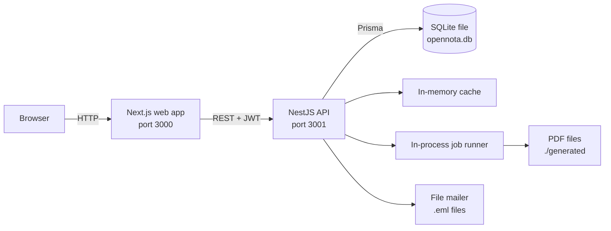

# OpenNota

**Open source school management and grading platform for Latin American schools.**

[](https://github.com/meser1905/opennota/actions/workflows/ci.yml)
[](./LICENSE)
[](./CONTRIBUTING.md)

OpenNota helps schools manage academic years, class groups, subjects,
evaluations and weighted grades, and produces printable report cards. It is
built to be cloned and running in about three minutes.

## Why OpenNota

Most school software is either expensive proprietary SaaS or a self-hosted
stack that needs a database server, a cache server and a container runtime
before it does anything useful. OpenNota takes the opposite stance for its MVP:

- **Zero-install dependencies.** No Docker, no PostgreSQL, no Redis, no cloud
  account. The database is a single SQLite file on disk.
- **Runs offline.** Once `pnpm install` has fetched the packages, everything
  runs locally. No external services are contacted.
- **Honest about grading.** Per-subject, per-term weighting of evaluation types
  (exam, assignment, performance, oral, project), with averages recomputed
  automatically when a grade changes.
- **Built to grow.** The cache, job runner and mailer are abstractions behind
  interfaces, and the schema is written so the move to PostgreSQL is a
  configuration change. See [docs/upgrading-to-postgres.md](./docs/upgrading-to-postgres.md).

## Features

- Authentication with JWT access tokens and rotating refresh tokens.
- Role-based access for five roles: admin, principal, teacher, student, guardian.
- Institution, academic year and term (trimester, quarter, bimester) management.
- Class groups, subjects and teacher assignments.
- Student enrollment and guardian linking.
- Evaluations with configurable scales and per-term grading weights.
- Single and batch grade entry with a grade sheet view.
- Automatic term-average calculation with an in-memory cache.
- Student report cards and class-group average reports.
- Report card export to PDF, with a copy saved to disk.
- Spanish user interface, ready for more locales.

## Tech stack

- **Monorepo:** Turborepo, pnpm workspaces.
- **API:** NestJS 11, Prisma 6.
- **Web:** Next.js 15 (App Router), React 19, Tailwind CSS, Radix UI,
  TanStack Query, Auth.js (NextAuth v5), next-intl.
- **Database:** SQLite via Prisma.
- **Validation:** Zod schemas shared by the API and the web app.
- **Language:** TypeScript across every package.
- **Tests:** Vitest for unit tests, Playwright for end-to-end tests.

## Prerequisites

You need only two things installed:

- **Node.js 20 LTS** (see [`.nvmrc`](./.nvmrc)).
- **pnpm 9 or newer.** Install with `npm install -g pnpm` or `corepack enable`.

You do **not** need any of the following:

- No Docker or any container runtime.
- No database server. SQLite is a file managed by Prisma.
- No Redis. The cache runs in process.
- No cloud account or network services. After `pnpm install`, OpenNota works
  fully offline.

## Getting started

```bash
# 1. Clone the repository
git clone https://github.com/meser1905/opennota.git
cd opennota

# 2. Create your environment file from the template
cp .env.example .env

# 3. Install dependencies, run migrations and seed the database
pnpm setup

# 4. Start the API and the web app together
pnpm dev
```

Then open <http://localhost:3000> and sign in with one of the test accounts
below. The API runs on <http://localhost:3001/api>.

`pnpm setup` runs `pnpm install`, then `pnpm db:migrate`, then `pnpm db:seed`,
so a fresh clone is fully ready after that single command.

### Test accounts

The seed (`packages/db/seed.ts`) creates these accounts. Every account in a
group shares the same password.

| Role      | Email                                                     | Password        |
| --------- | --------------------------------------------------------- | --------------- |
| Admin     | `admin@opennota.local`                                    | `Admin123!`     |
| Principal | `principal@opennota.local`                                | `Principal123!` |
| Teacher   | `teacher1@opennota.local` .. `teacher5@opennota.local`    | `Teacher123!`   |
| Student   | `student1@opennota.local` .. `student30@opennota.local`   | `Student123!`   |
| Guardian  | `guardian1@opennota.local` .. `guardian30@opennota.local` | `Guardian123!`  |

### Where is my data?

Nothing leaves your machine. Local artifacts live in these paths, all ignored
by git:

| What            | Location                       |
| --------------- | ------------------------------ |
| SQLite database | `packages/db/data/opennota.db` |
| Generated PDFs  | `./generated`                  |
| Outgoing emails | `./emails` (`.eml` files)      |
| Uploaded files  | `./uploads`                    |

## Useful commands

All commands are run from the repository root.

| Command             | Description                                        |
| ------------------- | -------------------------------------------------- |
| `pnpm setup`        | Install, migrate and seed. Run once after cloning. |
| `pnpm dev`          | Start the API and web app in watch mode.           |
| `pnpm build`        | Build every package.                               |
| `pnpm start`        | Run the built API and web app.                     |
| `pnpm test`         | Run the unit test suites.                          |
| `pnpm test:e2e`     | Run the Playwright end-to-end tests.               |
| `pnpm lint`         | Lint every package.                                |
| `pnpm typecheck`    | Type-check every package.                          |
| `pnpm format`       | Format the repository with Prettier.               |
| `pnpm format:check` | Check formatting without writing.                  |
| `pnpm db:migrate`   | Apply Prisma migrations.                           |
| `pnpm db:generate`  | Regenerate the Prisma client.                      |
| `pnpm db:seed`      | Re-seed the database.                              |
| `pnpm db:studio`    | Open Prisma Studio to inspect the database.        |
| `pnpm db:reset`     | Drop, recreate and re-migrate the database.        |
| `pnpm clean`        | Remove build output and `node_modules`.            |
| `pnpm clean:db`     | Delete the SQLite database file.                   |

## Monorepo structure

```text
opennota/
  apps/
    api/        NestJS REST API
    web/        Next.js web application
  packages/
    db/         Prisma schema, generated client and seed
    shared/     Domain enums, Zod schemas, cache and job abstractions
    config/     Shared ESLint and TypeScript configuration
  docs/         Architecture, domain model, API and operational docs
```

## Architecture

The web app talks to the API over HTTP. The API owns the database and all
business rules. SQLite, the cache, the job runner and the mailer are all local
to the API process.



Auth.js manages the browser session in the web app, while the NestJS API issues
and verifies the JWTs that authorize API requests. For the full picture, see
[docs/architecture.md](./docs/architecture.md).

### Scaling to PostgreSQL later

SQLite is a deliberate MVP choice, recorded in
[docs/adr/0001-sqlite-for-mvp.md](./docs/adr/0001-sqlite-for-mvp.md). When a
deployment outgrows it, [docs/upgrading-to-postgres.md](./docs/upgrading-to-postgres.md)
describes the migration.

## Running tests

```bash
# Unit tests (Vitest)
pnpm test

# End-to-end tests (Playwright). Install browsers once first.
pnpm exec playwright install
pnpm test:e2e
```

## Troubleshooting

Common setup problems and their fixes are collected in
[docs/troubleshooting.md](./docs/troubleshooting.md).

## Contributing

Contributions are welcome. Read [CONTRIBUTING.md](./CONTRIBUTING.md) for local
setup, branch naming, commit conventions and the pull request process. By
participating you agree to the [Code of Conduct](./CODE_OF_CONDUCT.md).

## Roadmap

OpenNota 0.1.0 is the MVP. Planned directions, none of which are committed
release dates:

- Multi-institution support (the schema already keys data to an institution).
- Additional locales (English and Portuguese) on top of the existing Spanish UI.
- Attendance tracking.
- A PostgreSQL deployment path for larger schools.
- Configurable report card templates.

## License

OpenNota is licensed under the GNU Affero General Public License v3.0. See
[LICENSE](./LICENSE) for the full text.
